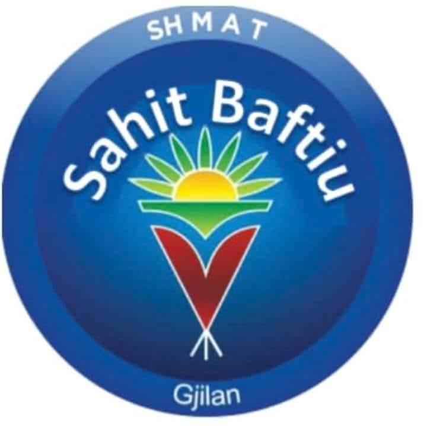

<!DOCTYPE html>
<html lang="sq">
<head>
    <meta charset="UTF-8">
    <meta name="viewport" content="width=device-width, initial-scale=1.0">
    <title>Biologjia Aplikative - SHML SAHIT BAFTIU</title>

    
</head>
<body>

<header>
    
    

        <h1>SHML SAHIT BAFTIU</h1>
        
Platformë mësimore - Biologjia Aplikative

    

</header>

<nav>
    <a href="#klasa10">Klasa 10</a>
    <a href="#klasa11">Klasa 11</a>
    <a href="#klasa12">Klasa 12</a>
    <a href="#fiziologjia">Fiziologjia</a>
    <a href="#mjedisi">Mjedisi Jetësor</a>
</nav>

<section id="klasa10">
    <h2>Klasa 10</h2>
    

        

            <h3>0. BIOLOGJIA 10 Libri</h3>
            <a href="materiale/Klasa%2010/0.%20BIOLOGJIA%2010%20Libri.pdf" class="btn" download>Shkarko Prezantimin</a>
            
            <h3>1. Qeliza dhe përbërja kimike e saj</h3>
            <a href="materiale/Klasa%2010/1%20Qeliza%20dhe%20përbërja%20kimike%20e%20saj.ppt" class="btn" download>Shkarko Prezantimin</a>
            
            <h3>2. PARAQITJA E JETËS NË TOKË</h3>
            <a href="materiale/Klasa%2010/2%20PARAQITJA%20E%20JETËS%20NË%20TOKË.ppt" class="btn" download>Shkarko Prezantimin</a>
            
            <h3>3. ORGANELET QELIZORE 1</h3>
            <a href="materiale/Klasa%2010/3.%20ORGANELET%20QELIZORE%201.ppt" class="btn" download>Shkarko Prezantimin</a>

            <h3>4. ORGANELET QELIZORE 2</h3>
            <a href="materiale/Klasa%2010/4.%20ORGANELET%20QELIZORE%202.ppt" class="btn" download>Shkarko Prezantimin</a>

            <h3>5. Krahasimi i qelizave</h3>
            <a href="materiale/Klasa%2010/5.%20Krahasimi%20i%20qelizave.ppt" class="btn" download>Shkarko Prezantimin</a>

            <h3>6. CIKLI JETЁSOR I QELIZЁS, MITOZA-MEJOZA</h3>
            <a href="materiale/Klasa%2010/6.%20CIKLI%20JETЁSOR%20I%20QELIZЁS,%20MITOZA-MEJOZA.ppt" class="btn" download>Shkarko Prezantimin</a>

            <h3>7. METABOLIZMI QELIZOR</h3>
            <a href="materiale/Klasa%2010/7.%20METABOLIZMI%20QELIZOR.ppt" class="btn" download>Shkarko Prezantimin</a>
        

        

            📂 Planprogramet - Klasa 10
            <a href="materiale/Klasa%2010/Planprogramet/Plani%20vjetor.doc" class="link-shtese" download>📄 Plani vjetor (Word)</a>
            <a href="materiale/Klasa%2010/Planprogramet/Plani%20mujor%20-%20Shtator-Qershor.doc" class="link-shtese" download>📄 Plani mujor</a>
            <a href="materiale/Klasa%2010/Planprogramet/Fletore%20pune%20Biologjia%2010.pdf" class="link-shtese" download>📕 Fletore pune 10</a>
            <a href="materiale/Klasa%2010/Planprogramet/Praktikum%20i%20Biologjise%20X.pdf" class="link-shtese" download>🧪 Praktikum i Biologjisë X</a>
            
            🎥 Videoprezentime
            <a href="#" class="link-shtese">▶️ Video: Ndërtimi i Qelizës</a>
            <a href="#" class="link-shtese">▶️ Video: Mikroskopi</a>
        

    

</section>

<section id="klasa11">
    <h2>Klasa 11</h2>
    

        

            <h3>0. BIOLOGJIA 11</h3>
            <a href="materiale/Klasa%2011/0.%20BIOLOGJIA%2011.pdf" class="btn" download>Shkarko Prezantimin</a>
            
            <h3>1. KARAKTERISTIKAT E PESË MBRETËRIVE</h3>
            <a href="materiale/Klasa%2011/1.%20KARAKTERISTIKAT%20E%20PESË%20MBRETËRIVE.ppt" class="btn" download>Shkarko Prezantimin</a>
            
            <h3>2. BAKTERIET</h3>
            <a href="materiale/Klasa%2011/2.%20BAKTERIET.ppt" class="btn" download>Shkarko Prezantimin</a>
        

        

            📂 Planprogramet - Klasa 11
            <a href="materiale/Klasa%2011/Planprogramet/Plani%20vjetor.doc" class="link-shtese" download>📄 Plani vjetor (Word)</a>
            <a href="materiale/Klasa%2011/Planprogramet/Plani%20mujor%20-%20Shtator-Qershor.doc" class="link-shtese" download>📄 Plani mujor</a>
            <a href="materiale/Klasa%2011/Planprogramet/Fletore%20pune%20Biologjia%2011.pdf" class="link-shtese" download>📕 Fletore pune 11</a>
        

    

</section>

<section id="klasa12">
    <h2>Klasa 12</h2>
    

        

            <h3>0. Biologjia 12</h3>
            <a href="materiale/Klasa%2012/0.%20Biologjia.pdf" class="btn" download>Shkarko Prezantimin</a>
            
            <h3>1. Biokimia</h3>
            <a href="materiale/Klasa%2012/1.%20Biokimia.ppt" class="btn" download>Shkarko Prezantimin</a>
        

        

            📂 Planprogramet - Klasa 12
            <a href="materiale/Klasa%2012/Planprogramet/Plani%20vjetor.doc" class="link-shtese" download>📄 Plani vjetor</a>
            <a href="materiale/Klasa%2012/Planprogramet/Praktikum%20i%20Biokimisë.doc" class="link-shtese" download>🧪 Praktikum i Biokimisë</a>
        

    

</section>

<section id="fiziologjia">
    <h2>Fiziologjia e shtazeve dhe njeriut</h2>
    

        

            <h3>0. Fiziologji e shtazeve dhe njeriut</h3>
            <a href="materiale/Fiziologjia%20e%20shtazeve%20dhe%20njeriut/0.%20Fiziologji%20e%20shtazeve%20dhe%20njeriut.pdf" class="btn" download>Shkarko Prezantimin</a>
            <h3>1. QELIZA DHE ORGANELET E SAJ</h3>
            <a href="materiale/Fiziologjia%20e%20shtazeve%20dhe%20njeriut/1.%20QELIZA%20DHE%20ORGANELET%20E%20SAJ.ppt" class="btn" download>Shkarko Prezantimin</a>
        

        

            📂 Planprogramet - Fiziologjia
            <a href="materiale/Fiziologjia%20e%20shtazeve%20dhe%20njeriut/Planprogramet/Plani%20vjetor.doc" class="link-shtese" download>📄 Plani vjetor</a>
            <a href="materiale/Fiziologjia%20e%20shtazeve%20dhe%20njeriut/Planprogramet/Fletore%20pune%20Fiziologjia.pdf" class="link-shtese" download>📕 Fletore pune</a>
        

    

</section>

<section id="mjedisi">
    <h2>Biologji e mjedisit jetësor</h2>
    

        

            <h3>0. BIOLOGJI E MJEDISIT JETËSOR</h3>
            <a href="materiale/Biologji%20e%20mjedisit%20jetësor/0.%20BIOLOGJI%20E%20MJEDISIT%20JETËSOR.pdf" class="btn" download>Shkarko Prezantimin</a>
        

        

            📂 Planprogramet - Mjedisi
            <a href="materiale/Biologji%20e%20mjedisit%20jetësor/Planprogramet/Plani%20vjetor.doc" class="link-shtese" download>📄 Plani vjetor</a>
        

    

</section>

<footer>
    © 2026 SHML SAHIT BAFTIU | Gjilan  
    Të gjitha të drejtat e rezervuara.
</footer>

</body>
</html>
